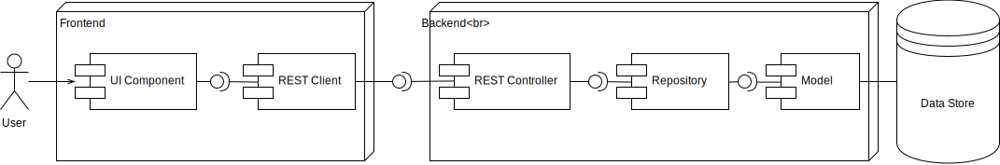

# Prerekvizity

-   Maven
-   GIT
-   MongoDB (pro správu např. MongoDB Compass)

# Instalace

```
git clone https://github.com/zdebou/liquor-exchange.git
cd liquor-exchange/src
mvnw install
```

Stalo se mi, že selhalo spuštění `npm install` na chybě _CreateProcess error=193, %1 is not a valid Win32 application_ a potom mi pomohlo toto:

```
mvnw dependency:purge-local-repository -DmanualInclude=com.github.eirslett:node
mvnw clean package
```

## MongoDB

Pokud instalujete MongoDB lokálně, tak by neměla být potřeba žádná speciální konfigurace.

Pokud jej nainstalujete na jiný stroj, než na kterém děláte vývoj, tak budete muset vytvořit kolekci a v ní uživatele s heslem (viz soubor **src/main/mongo/createdb.mongo**). Defaultní konfigurace počítá s kolekcí pojmenovanou **liquor** a uživatelem **usr/xyz123**. To si samozřejmě můžete změnit v konfiguraci (viz níže).

# Konfigurace

Java Spring se konfiguruje v souboru **main/java/resources/application.properties**. Tam si například nastavíte připojení k databázi.

Položka `com.liquorexchange.resetdb` určuje, zda se má databáze při každém nastartování backendu resetovat (soubor **DatabaseLoader.java**). Pro vývoj je většinou dobré mít to zapnuté, pro produkci určitě ne.

# Spuštění

```
mvnw spring-boot:run
```

Aplikace teď běží adrese `http://localhost:8080`.

## Docker

-   je třeba nainstalovat docker
    -   https://hub.docker.com/editions/community/docker-ce-desktop-windows

```
mvnw package && docker-run
```

# Vývoj

Obecný diagram komponent:



## Lombok

-   pro vývoj backendu doporučuji plugin pro Lombok, který IDE upozorní na metody generované Lombokem

## TypeScript (frontend)

-   doporučené jsou pluginy pro TSLint a Prettier, které jsou dostupné pro většinu IDE
-   alternativně lze kontrolu kódu pustit ručně přes `npm run check`

## Hot Swap

Aplikace se při změně automaticky zbuildí a restartuje. Je to vlastnost modulu **spring-boot-devtools**, ale aby to fungovalo v IDEA, musel jsem jít podle tohoto návodu: https://dzone.com/articles/spring-boot-application-live-reload-hot-swap-with

## LiveReload

Pro automatický refresh stránky je potřeba do prohlížeče přidat plugin **LiveReload** (Firefox nebo Chrome). Pro práci na frontendu je třeba spustit `npm run watch`.

# Testování

Testy v Cucumber se spustí takto:

```
mvnw test
```

# Verzování a práce s GITem

Budeme určitě používat _developer branches_ a kdo chce, tak může dělat _feature brnaches_. Vývoj a přidávání vlastního kódu je potřeba dělat ve vlastní větvi a následně udělat pull request! Nikdo prosím nedělejte commit do **master**, ale pouze do vlastní větve.

# Build WAR

Balíček pro Tomcat se vygeneruje spuštěním následujícího příkazu:

```
mvnw clean install spring-boot:repackage
```

# Návody a tutoriály

-   Spring Boot: https://spring.io/guides/gs/spring-boot/
-   React & Spring Data: https://spring.io/guides/tutorials/react-and-spring-data-rest/
-   Debugging in Spring: https://www.baeldung.com/spring-debugging
-   Auto reload: https://dzone.com/articles/spring-boot-developer-tools-and-live-reload
-   MongoDB:
-   https://www.tutorialspoint.com/mongodb/
-   https://medium.com/founding-ithaka/setting-up-and-connecting-to-a-remote-mongodb-database-5df754a4da89
-   https://docs.mongodb.com/manual/tutorial/enable-authentication/
-   https://docs.spring.io/spring-data/mongodb/docs/current/reference/html/
-   jak se rozhodnout mezi _embedd_ a _reference_: https://stackoverflow.com/questions/5373198/mongodb-relationships-embed-or-reference?rq=1
-   filtering: https://www.baeldung.com/queries-in-spring-data-mongodb
-   Lombok: https://projectlombok.org/
-   schéma yup (validace formulářů): https://github.com/jquense/yup
